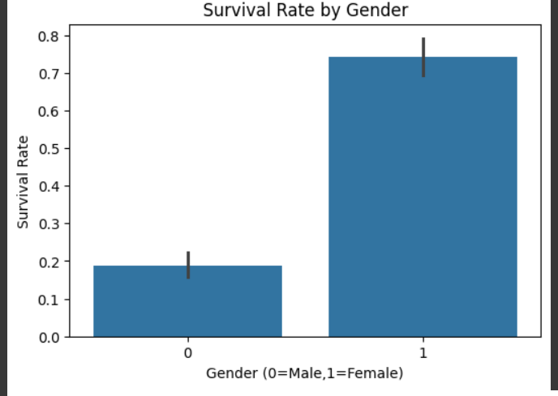
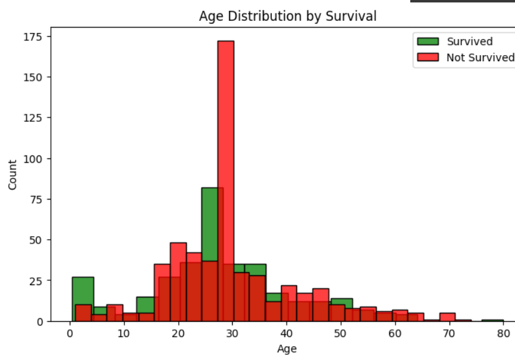
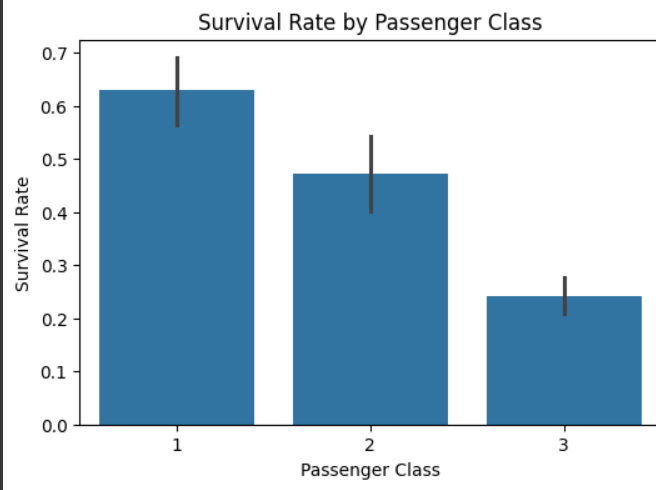

# TitanicInsights 🚢
Exploratory Data Analysis & Data Cleaning — Titanic Dataset | Prodigy InfoTech Data Science Internship (Task 2)

This repository contains **Task 2** of my **Prodigy InfoTech Data Science Internship**.

📌 Task Description
Perform data cleaning and exploratory data analysis (EDA) on a dataset of your choice, such as the Titanic dataset from Kaggle. Explore the relationships between variables and identify patterns and trends.

🗂 Dataset
For this task, the **Titanic dataset from Kaggle** was used: [https://www.kaggle.com/c/titanic/data](https://www.kaggle.com/c/titanic/data)


⚙️ Steps Performed
- Imported and cleaned the dataset (handled missing values, encoded categorical variables).
- Generated descriptive statistics.
- Plotted distributions, correlations, and relationships between variables.
- Identified key patterns and trends.

🚀 How to Run Locally

Clone the repository:
```bash
git clone https://github.com/SandhyaAK24/TitanicInsights.git
cd TitanicInsights
```

Install dependencies:
```bash
pip install pandas matplotlib seaborn
```

Run the script:
```bash
python task2.py
```

🛠 Tech Stack
- Python
- Pandas
- Matplotlib
- Seaborn

📈 Sample Output

**Survival Rate by Gender**



**Age Distribution by Survival**



**Survival Rate by Passenger Class**



🙌 Acknowledgements
This project was completed as part of the **Prodigy InfoTech Data Science Internship** program.

---
⭐ If you found this useful, feel free to star the repo!
